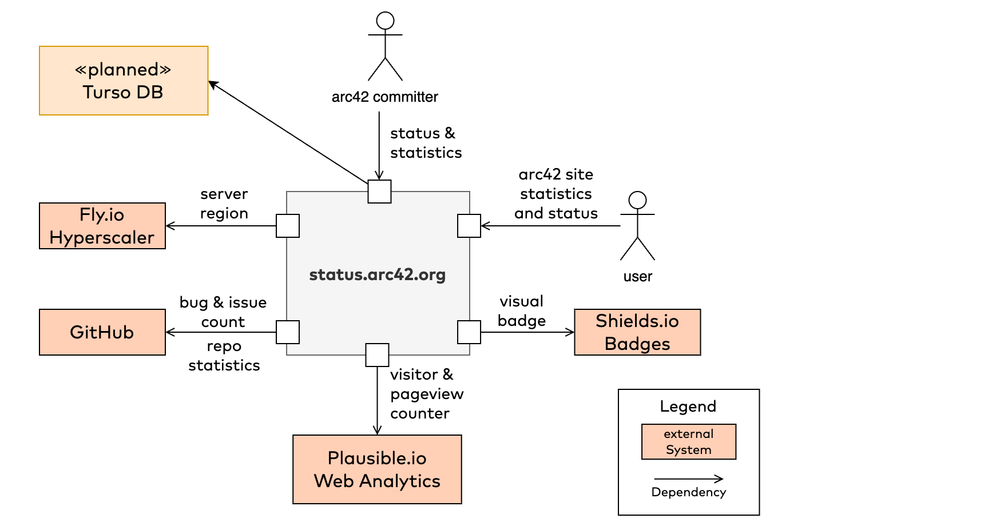

# Status and Statistics Overview
like all cool websites we need a status-subdomain with some statistics.

## Overview

| Element | Description |
| --- | --- |
| Plausible.io | This (commercial) service collects usage data. We access via their API |
| GitHub | Bug- and Issue-counter, plus additional repository status. Access via GraphQL |
| Fly.io | Our cloud provider (aka hyperscaler). We query the geographical region from their API.|
| Turso DB | in planning: A distributed, self-replicating SQLite database in the cloud. |
