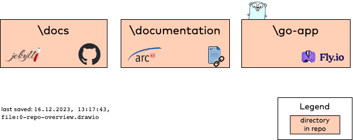

# Repository Overview
Like all cool websites, arc42 has a status-subdomain, showing usage- and repo statistics for its domains and subdomains.

This is a _multi-repo_, and the directories are organized as follows:

| **Static Jekyll Site** | **Documentation**  | **Statistic service (Go app)** |
|------|--------|----------------|
| [**/docs**](/docs) | [**/documentation**](/documentation) |[**/go-app**](/go-app)  |
|  Jekyll/Github-pages based static website.|arc42-based technical  documentation, created with docToolchain. | Cloud-based statistics service written in Golang |
|  |    |    |

## Technologies used

## Development and Feature Planning

Upcoming features and are planned with a [GitHub project](https://github.com/orgs/arc42/projects/5/views/1)

## Supported by INNOQ

This work is actively supported by [INNOQ Deutschland GmbH](https://innoq.com).

## Licence

This content is provided _as-is_, without any guarantees. 
It is open-source under the [Creative-Commons-ShareAlike 4.0](https://creativecommons.org/licenses/by-sa/4.0/deed.en) licence:

* see the [original text](https://creativecommons.org/licenses/by-sa/4.0/) and the
* [legal details](https://creativecommons.org/licenses/by-sa/4.0/legalcode.en)

Created 2023 by [Dr. Gernot Starke](https://gernotstarke.de) and contributors. 

