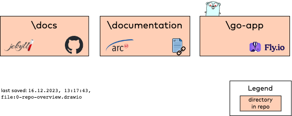

# Repository Overview
Like all cool websites, arc42 has a status-subdomain, showing usage- and repo statistics for its domains and subdomains.

This is a _multi-repo_, and the directories are organized as follows:

| **Static Jekyll Site** | **Documentation**  | **Statistic service (Go app)** |
|------|--------|----------------|
| [**/docs**](/docs) | [**/documentation**](/documentation) |[**/go-app**](/go-app)  |
|  Jekyll/Github-pages based static website.|arc42-based technical  documentation, created with docToolchain. | Cloud-based statistics service written in Golang |
| [](https://github.com/arc42/status.arc42.org-site/actions/workflows/pages/pages-build-deployment) |    | [](https://github.com/arc42/status.arc42.org-site/actions/workflows/fly.yml) <br>[](https://github.com/arc42/status.arc42.org-site/actions/workflows/golang-lint.yml) |



## Development and Build Targets

We use `make` (`Makefile`, see [ADR-0020](documentation/adrs/0020-use-make-for-build-test-and-deployment.md)) as the single entry point for development, database schema management, testing, and deployment:

### Local Development

This site runs as two processes during local development:

```bash
make backend    # terminal 1: run the Go statistics service on :8043
make site       # terminal 2: run the Jekyll dev server on :4270
make doctor     # verify setup health (Docker, Go, flyctl, Atlas, secrets, ports)
make help       # show all available make targets
```

`make site` loads `docs/_config.dev.yml`, pointing the static site to the local backend. The deployed site uses `_config.yml` (pointing to Fly.io).

The backend requires `go-app/set-api-keys.sh`, created from template:

```bash
cp go-app/set-api-keys.sh.template go-app/set-api-keys.sh
```

### Maintainer login (rollup page)

`/rollup` on the service is for people with push access to
`arc42/status.arc42.org-site` only (ADR-0022). To use it locally:

1. Create a GitHub OAuth App (GitHub → Settings → Developer settings → OAuth Apps),
   homepage `http://localhost:4270`, authorization callback URL
   `http://localhost:8043/auth/callback`.
2. Put its client ID and a new client secret into `go-app/set-api-keys.sh`, together with
   `SESSION_KEY` (`openssl rand -base64 32`), `PUBLIC_BASE_URL=http://localhost:8043` and
   `PLAUSIBLE_ROLLUP_SHARE_URL` (see `set-api-keys.sh.template`).
3. `make backend`, then open http://localhost:8043/rollup.

Production uses a second OAuth App with callback `https://arc42-stats.fly.dev/auth/callback`;
its values are fly secrets (`make fly-secrets` lists them). Without the login variables
`/rollup` answers 503. Locally the site's web fonts may not load on the page, because the
Jekyll dev server sends no CORS headers for them.

### Database & Schema Management (Atlas)

Database schemas for both local SQLite (`~/arc42-stats-dev.db`) and production TursoDB (`libsql://...`) are declaratively managed with Atlas ([ADR-0013](documentation/adrs/0013-use-atlas-for-declarative-database-schema-management.md)):

```bash
make db-apply-dev   # Apply schema.hcl to local development SQLite DB
make db-apply-prod  # Apply schema.hcl to production TursoDB
make db-diff-dev   # Dry-run / diff schema against local dev DB
make db-diff-prod  # Dry-run / diff schema against production TursoDB
make db-validate   # Validate schema syntax against an in-memory DB
make db-shell-dev  # Open interactive sqlite3 shell on local dev DB
```

Availability is measured by an external cron trigger ([cron-job.org](https://cron-job.org), every ~15 minutes, [ADR-0019](documentation/adrs/0019-availability-monitoring-with-github-actions-prober.md)) calling the secure `POST /api/probe` endpoint on the Go backend service, which writes availability records into TursoDB. Locally: `make db-apply-dev` once, then `make probe`.

### Fly.io Deployment & Diagnostics

The backend Go app is hosted on Fly.io ([ADR-0008](documentation/adrs/0008-deploy-on-fly-io.md)). Manage deployments directly via `make`:

```bash
make fly-deploy   # Deploy backend Go service to Fly.io
make fly-status   # Show status of Fly.io app and machines
make fly-logs     # Tail live production logs from Fly.io
make fly-ssh      # Open SSH console session on running Fly.io instance
make fly-secrets  # List secrets configured on Fly.io
```

### Build, Test & Lint

```bash
make build    # Compile the Go service to go-app/arc42-status
make test     # Run Go unit tests
make lint     # Run golangci-lint over the Go code
```

## Technologies used


## Development and Feature Planning


Upcoming features and are planned with a [GitHub project](https://github.com/orgs/arc42/projects/5/views/1)

## Supported by INNOQ

This work is actively supported by [INNOQ Deutschland GmbH](https://innoq.com).


## Licence


This content is provided _as-is_, without any guarantees. 
It is open-source under the [Creative-Commons-ShareAlike 4.0](https://creativecommons.org/licenses/by-sa/4.0/deed.en) licence:

* see the [original text](https://creativecommons.org/licenses/by-sa/4.0/) and the
* [legal details](https://creativecommons.org/licenses/by-sa/4.0/legalcode.en)


Created 2023 by [Dr. Gernot Starke](https://gernotstarke.de) and contributors. 

